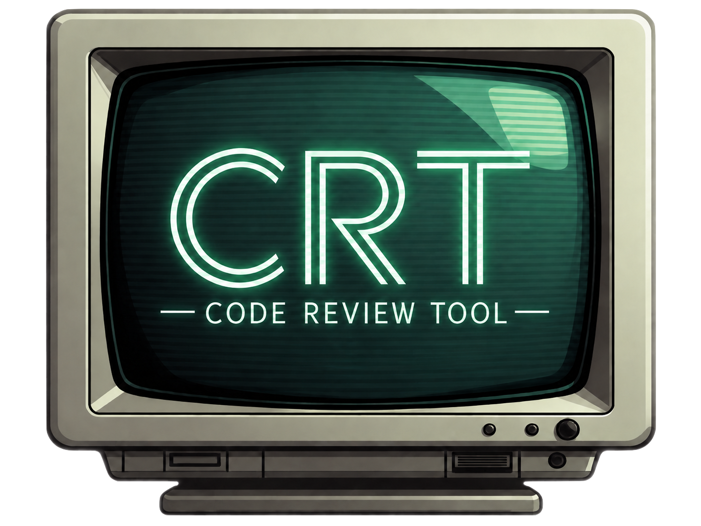

<p align="center">
  
</p>

# crt

`crt` is a code review tool for humans (or agents) to review code written by
agents (or humans).

You can use it to view all changes since a specific commit, comment on things
that need improving and approve changes that you are happy with.

An agent picks up your comments over MCP and fixes any issues, then you rinse
and repeat until your changes are done.

No pull requests. No browser tabs. No repeatedly skipping over hundreds of
lines of code that you are already happy with. No pasting snippets into a chat
window, and no describing a location in prose and hoping the agent finds it.

Just reviewing code, and having an agent pick up the changes.

## Why crt?

In an agentic world, code is increasingly written, reviewed and deployed to
production without human involvement.

`crt` is for the opposite use case, where code written by an agent still
needs human oversight and still requires a human to understand and be
responsible for what ends up in production.

The problem is that agents write code faster than humans can review it, and
reviewing large volumes of agent-written code is cumbersome and painful.

- **Feedback lands in the wrong place.** You read code in one window and
  describe the problem in another. Copying context between them is a poor way
  to point at specific sections of code.
- **Nothing is machine-readable.** The agent has to reconstruct from your
  prose what you were looking at, wasting tokens and time.
- **Iterative review is noisy.** In a large review you may be 90% happy
  with the changes but still need iteration and discussion on the last 10%.
  You need an easy way to focus on the 10% you care about while ignoring the
  90% that is already good.
- **You lose your place.** Agents amend, squash, and rebase constantly.
  Anything that tracks "files I have already read" by commit or by line
  number discards that on the first rebase and makes you start over.

`crt` allows you to lean on AI to write the code, and then provides a tight
feedback loop for reviewing and improving that code.

## The review loop

Use an agent to write code and commit as it goes (preferably with [atomic
commits](https://www.aleksandrhovhannisyan.com/blog/atomic-git-commits/)).

When it finishes, use crt review those changes:

```sh
crt <parent-of-unreviewed-commits>
```

You get a two-pane TUI: changed files on the left, the diff on the right.

- Press `]` and `[` to jump between hunks.
- Press `Ctrl-n` / `Ctrl-p` to switch between next/previous files.
- Press `a` to approve the file (it drops out of your way and you won't see
  its diff again unless it changes).
- Press `c` (or space) on a line to comment on it, or press `V` to select a
  range of lines first. Type the comment and it is attached to that code.
- Press `?` for the full keybinding list (many common vi keybindings work).

Now point your agent at the review. Over MCP it calls:

1. `list_review_sessions`, then `select_review_session` to attach to the
   review you are running.
2. `list_review_comments` to see what you flagged, and
   `get_comment_detail` for the exact lines and surrounding context.
3. `get_file_diff`, `search_codebase`, and `find_definition` to work out
   what the fix should be.
4. `resolve_comment` once it has made the change.

Your TUI updates as the agent resolves comments — the server pushes the
change to every connected client. Files whose diff actually changed
reappear as needing another look. Everything else stays approved.

## Comments survive rebasing

Comments are anchored to the **content** they were attached to, not to a
line number. Each comment stores the exact code it covers plus the lines
around it. When the file changes, `crt` looks for that content again:

- Found where it was: the comment stays put.
- Found elsewhere: the comment moves with the code.
- Found approximately, via the surrounding context: the comment follows,
  flagged as approximate.
- Not found at all: the comment is kept and marked orphaned, with its
  last known context, rather than silently disappearing.

Approvals work the same way. `crt` records a hash of each file's diff when
you approve it. After a rebase, files whose diff is unchanged stay
approved; only files that genuinely changed come back.

This means your agent can rewrite history under you and you do not lose the
review.

## Working while the agent works

Review state is keyed on the merge base and the branch, not on a
directory. So the agent can work in a `git worktree` while you review from
the main working tree, and you are both looking at the same review.

Comments, resolutions, and approvals are shared live. You can specify base
references with tags, branches, commit hashes, HEAD~5 shortcuts and more
and references that resolve to the same commit are the same review, so you and
the agent do not have to agree on how to spell the base ref.

## Agents reviewing agents

Reviewing agents get the same tools you do. An agent can call
`create_review_comment` to attach a comment to a line range, and
`mark_file_reviewed` to approve files as it works through the diff.

That makes the reviewer replaceable: one agent reviews the branch and
leaves comments, another reads them, fixes the code, and resolves them —
and you can open the same review in the TUI at any point to see both
sides of that conversation.

## Review markers in source files

Not every agent speaks MCP. For those, `crt` can write your comments
directly into the source files in your worktree, using each file's own
comment syntax:

```rust
// <<<<<<< REVIEW #42
fn process(input: &str) -> Result<Output> {
    let parsed = parse(input);
}
// =======
// Does parse() handle empty input? If input is "", this
// will silently produce a default value.
// >>>>>>> REVIEW #42
```

The file still compiles, the feedback is right next to the code, and the
comment id lets an agent resolve it later. Applying and clearing markers
is idempotent, so you can round-trip freely.

*Not implemented yet — see Status below.*

## Getting started

Build `crt` and put it on your `PATH`:

```sh
cargo build --release
cp target/release/crt ~/.local/bin/crt
```

Then review a branch:

```sh
crt main          # review main..HEAD
crt HEAD~3        # review the last 3 commits
crt --root        # review everything back to the first commit
crt main --reset  # throw away review state for this branch
```

To let an agent join the review, add `crt` as an MCP server. For example:

```json
{
  "mcpServers": {
    "crt": {
      "command": "/path/to/crt",
      "args": ["mcp-server"],
      "env": {
        "CRT_SERVER_HOST": "127.0.0.1",
        "CRT_SERVER_PORT": "25175"
      }
    }
  }
}
```

Review state lives in `.crt/reviews.db` in your repository root. It is
local and personal, so add `.crt/` to your `.gitignore`.

## Status

`crt` is still in early development. It is used daily, but the interface and
the stored data format can still change without a migration path.

Planned:

- A native GUI alongside the TUI.
- Better comment span behaviour: spans do not always expand or collapse
  intuitively when lines are added or deleted inside them.
- Review markers in source files, for agents without MCP.

## Learn more

`docs/OVERVIEW.md` covers the architecture, the full keybinding and
command reference, the server API, and the design decisions behind the
storage and anchoring models.
